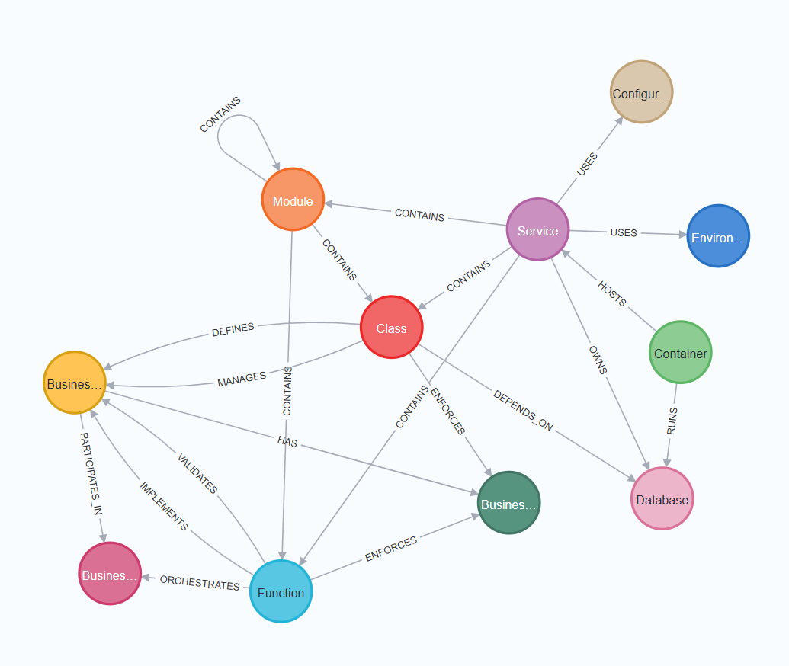
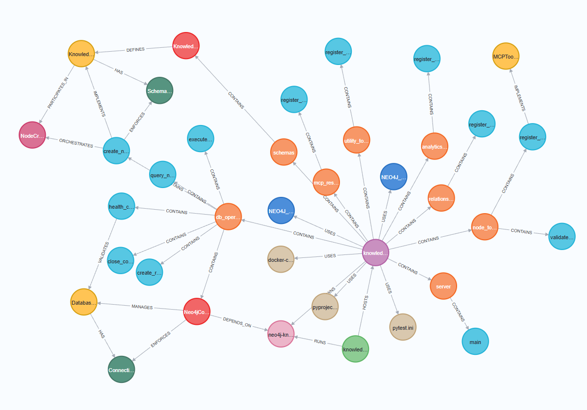

# Knowledge Graph MCP Server

A Model Context Protocol (MCP) server for managing knowledge graphs with Neo4j backend. Provides AI agents with the ability to create, query, and analyze knowledge graph structures.
Our knowledge graph MCP is useful for encoding and modeling domain specific knowledge in a way that is accessible to both human and AI alike.


## Use Cases

### Software Engineering Documentation

Our knowledge graph schemas are specifically designed for software engineering domains, featuring **8 categories** that represent common software development knowledge, with **48 entity types** and **149 relationships**. This comprehensive schema enables:

- **Automatic Code Documentation**: Connect this MCP server to your favorite AI coding tools to automatically document code repositories, capturing complex relationships and dependencies
- **Cross-Repository Analysis**: Track long-range dependencies that span multiple repositories, services, and databases
- **Architecture Visualization**: Map out system architectures and understand how different components interact
- **Technical Debt Management**: Identify and track technical debt across your entire codebase ecosystem


### What it means for our interaction with the AI agent

Traditional AI agents struggle with understanding complex, long-range dependencies and multi-hop reasoning that span across different parts of a system. Vector-based RAG (Retrieval Augmented Generation) excels at finding semantically similar content but falls short when it comes to capturing global context and dependencies that span the entire corpus and beyond the context window limit.

**The Knowledge Graph Advantage:**

Our knowledge graph MCP server enhances how AI agents understand and reason about complex systems by providing:

#### 🌐 **Global Context Understanding**
- **Beyond Chunk-wise retrieval**: Instead of processing information chunk wises, AI agents can now explore the whole graph and directionally traverse to where they need to go
- **Relationship-Driven Insights**: Agents can follow explicit relationships (like "ServiceA DEPENDS_ON DatabaseB") rather than relying solely on semantic similarity
- **Multi-hop Discovery**: Complex queries like "how is X related to Y" become answerable in one LLM call through graph traversal even though there may not be any explicit connection between X and Y in the corpus. This allows discovery of unexpected relationships between seemingly unrelated components.

#### 🎯 **Practical Benefits for AI Interactions**
- **Tacit Knowledge Capture**: Transform implicit organizational knowledge into explicit, queryable relationships that preserve institutional memory and expertise
- **Accelerated Onboarding**: New team members can quickly understand complex systems through AI-guided exploration of the knowledge graph, reducing ramp-up time from weeks to days
- **Automatic Documentation**: The AI agent automatically captures and encode relationships as code evolves, creating living documentation that stays current (for an example: see our knowledge graph on the knowledge graph MCP made by an AI agent using this knowledge graph MCP)


#### 🧠 **Tacit Knowledge & Organizational Memory**

One of the most powerful aspects of knowledge graph MCP is its potential to capture **tacit knowledge** - the unwritten, experiential knowledge that exists in developers' heads (or their private chats with AI agents) but is rarely documented:

- **Institutional Memory Preservation**: with the right schema and the right prompts to an AI agent, the team's understanding of "why this was built this way" and "what depends on what" can be preserved in the graph structure.
- **Decision Context Capture**: The graph can encode not just what exists, but why certain architectural decisions were made and what alternatives were considered
- **Tribal Knowledge Democratization**: Knowledge that was previously accessible only to specific team members becomes queryable by AI agents for the entire organization

This structured approach to knowledge representation enables AI agents to reason more like domain experts - understanding not just what components exist, but how they relate, depend on each other, and influence the broader system architecture.


## Domain-Specific Knowledge Modeling

We focus on software development as our primary domain because it's where our expertise lies. However, the knowledge graph architecture is domain-agnostic and our MCP server is built for extensibility. Users can easily adapt the server to capture knowledge in any domain by:

- **Custom Schema Definition**: Replace or extend the existing schemas with domain-specific entities and relationships
- **Knowledge Domain Encoding**: Model any structured knowledge domain where relationships between entities are critical
- **Expert Knowledge Capture**: Encode domain expertise in a format that's accessible to both humans and AI systems

The key insight is that **schemas** (the lists of entities and their associated relationships) are fundamental to modeling specific knowledge domains effectively. We provide the infrastructure and leave the domain expertise encoding to our users.

## Features

- 🔧 **CRUD Operations**: Full create, read, update, delete for nodes and relationships
- 🧠 **Entity Normalization**: Automatic duplicate detection and merging
- 📊 **Graph Analytics**: Structure analysis and statistics
- ✅ **Schema Validation**: Automatic validation against predefined schema
- 🔋 **Battery Included**: Pre-configured integration with Neo4j, the industry-leading graph database
- 🧪 **Comprehensive Tests**: Unit, integration, and performance tests


## Knowledge graph

here is our current partial schema representing a typical software development specific knowledge
about a software project




and this is the knowledge graph representing the knowledge graph MCP that a cursor AI useing the knowledge graph MCP able to construct



## Quick Start

### 1. Install Dependencies

```bash
cd mcp_servers/knowledge-graph-mcp
uv venv
source .venv/bin/activate
uv sync
```

### 2. Start Neo4j Database

```bash
cd docker
docker-compose up -d
```

### 3. Set Environment Variables

```bash
export NEO4J_URI="bolt://localhost:7688"
export NEO4J_USER="neo4j"
export NEO4J_PASSWORD="password"
```

### 4. Test the Server

```bash
python -m pytest tests/ -v
```

## Registering with Cursor or CLI tools


Add to your Cursor MCP configuration file (`~/.cursor/mcp_servers.json` or similar):

```json
{
  "mcpServers": {
    "knowledge-graph-mcp": {
      "command": "uv",
      "args": [
        "run",
        "--directory",
        "/path-to-your-mcp-server/knowledge-graph-mcp",
        "-m",
        "knowledge_graph_mcp.server"
      ],
      "env": {
        "NEO4J_URI": "bolt://localhost:7688",
        "NEO4J_USER": "neo4j",
        "NEO4J_PASSWORD": "password"
      }
    }
  }
}

```


## Environment Variables

### Required Variables

| Variable | Description | Default | Example |
|----------|-------------|---------|---------|
| `NEO4J_URI` | Neo4j database URI | `bolt://localhost:7688` | `bolt://localhost:7688` |
| `NEO4J_USER` | Neo4j username | `neo4j` | `neo4j` |
| `NEO4J_PASSWORD` | Neo4j password | `password` | `your-secure-password` |


#### For Docker Deployment
```yaml
environment:
  - NEO4J_URI=bolt://neo4j:7687
  - NEO4J_USER=neo4j
  - NEO4J_PASSWORD=password
```

## Future Enhancements

Here's what's coming next:

### 🎯 Near-term Goals
- **📋 Flexible Schema Configuration**: Extract graph schemas to separate YAML files for easy customization across different knowledge domains
- **✅ Enhanced Relationship Validation**: Implement comprehensive schema validation for all relationship types
- **🔍 Semantic Search**: Add vector indexing capabilities for intelligent, meaning-based graph queries

### 🚀 Future Vision
- **📊 Interactive Graph Visualization**: Built-in MCP tool for interactive visualization of graph data
- **🧠 Advanced Entity Normalization**: AI powered duplicate detection and entity resolution
- **🔗 Graph Clustering & Communities**: Automatic discovery of related entity clusters and knowledge communities
